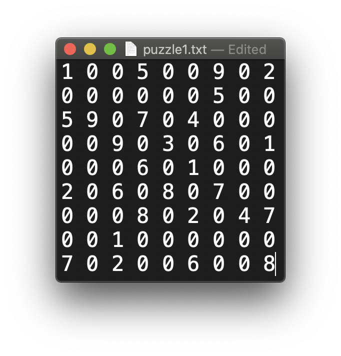
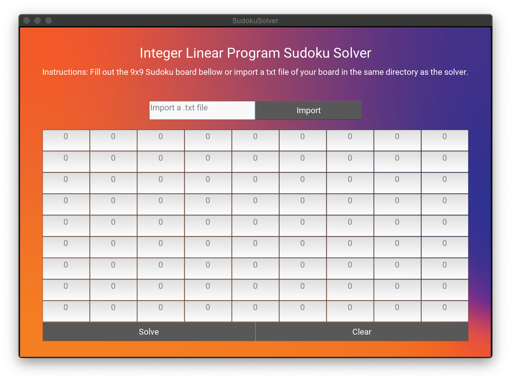
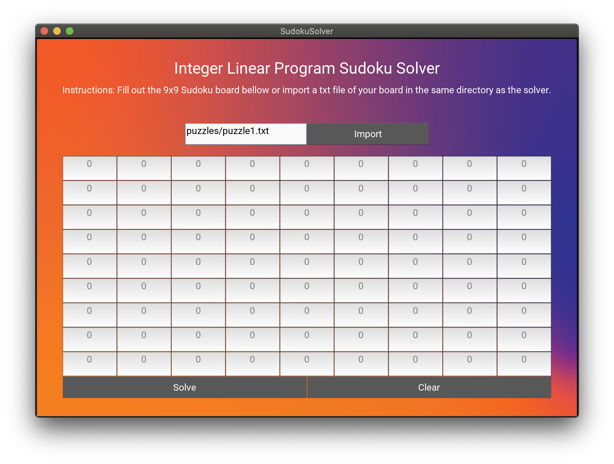
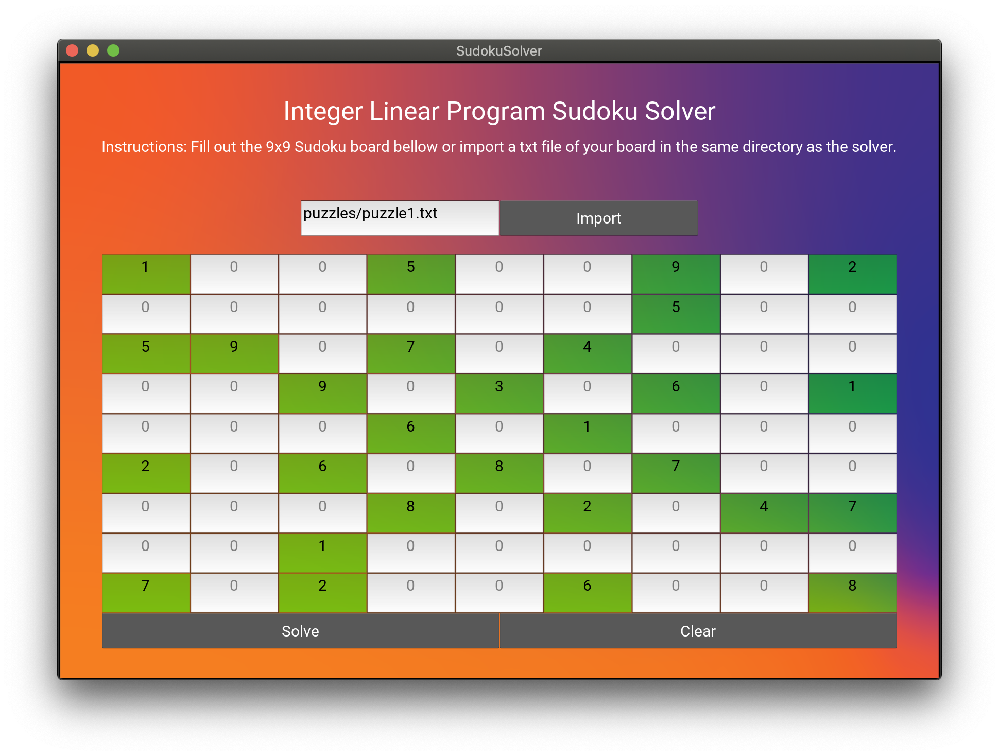

# Sukoku_ILP_Solver

## **MATH 4400**: Linear Program 
### Course Project 3: Sudoku - Integer Programming Formulation 
**Professor**: Dr. Boshi Yang  
**Names**: Josh Norman and Delaney Higgins
___

**Requirements**: Python 2.7.1, Kivy and Pulp 
    
    # Install PuLP 
        pip install pulp

    # Install of Kivy (Mac OS)
        python -m pip install kivy
        python -m pip install ffpyplayer

Resources: 

- https://towardsdatascience.com/using-integer-linear-programming-to-solve-sudoku-puzzles-15e9d2a70baa

- https://benalexkeen.com/linear-programming-with-python-and-pulp-part-4/

___

## Linear Constraint of the Linear Program 

The set up calls for 729 parameters or 9^3. Where there are 9 values, 9 rows, 9 columns
Therefore the problem is taken into three dimension trucating the problem into 9 different board 
which only one "value" can exist within. Therefore will create a linear program using only Binary 
constraints. These values with represent a value hit(1) or miss(0). 

    MAX 0 

        S.T. 

            - The sum from v =[1,9] of (Xvrc)= 1 for r,c exist within [1,9]

            - The sum from r =[1,9] of (Xvrc)= 1 for v,c exist within [1,9]

            - The sum from c =[1,9] of (Xvrc)= 1 for v,r exist within [1,9]
    
            - The sum from r=[3p-2,3p] of the sum from c=[3q-2,3q] of (Xvrc)= 1 for v exist within [1,9] and p,q exist within [1,3]

___
## Terminal Usage 

**Only requires PuLp Library**
- Create a .txt file to resemble the 9x9 sudoku board you wish to solve 
    -  Replace each blank on the board with a zero
    -  *Make sure there are no extra spaces after each row*

- Update the main function within sudoku.py  to use the text file you just created

- Lanuch your terminal and locate this directory 
- Run using the following command 

        python sudoku.py 

___
## GUI Usages
   **Requires both Kivy and PuLp** 

- **Start Application
    -  Run using the following command
      
      python sudokuUI.py 

- **Board Input** 
    - Clicks the boxes you wish to insert a number into
    - Or load a text file by typing in the file name and pressing import 

- **Solve** 
    - Click the solve button for a solution using the lienar program formulation 
    - If you want to test another board please press "Clear"

